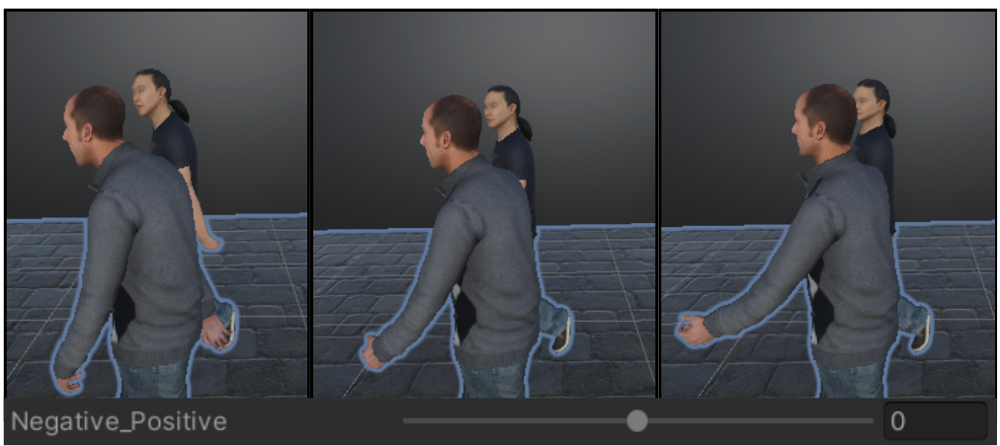
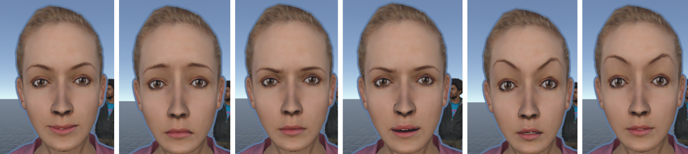
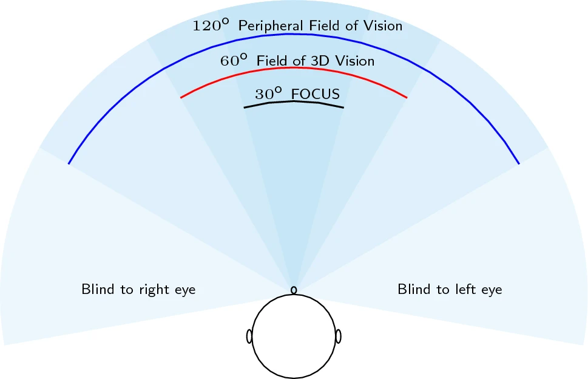
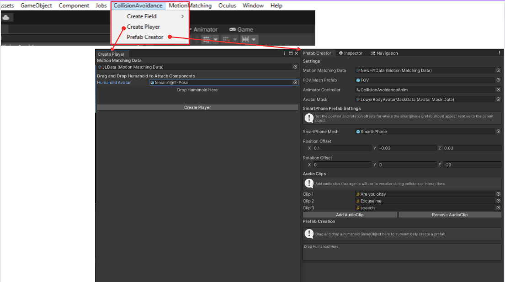

# Collision Avoidance System

Welcome to the Collision Avoidance system repository, where agents dynamically navigate a simulated environment. This system is designed to simulate realistic pedestrian behavior by integrating a variety of forces that guide agents towards their goals, enable avoidance of collisions, and facilitate natural group formations.


## Table of Contents
- [System Overview](#system-overview)
- [Key Features](#key-features)
- [Getting Started](#getting-started)
- [References](#references)

## System Overview

The movement of each agent within our system is influenced by a combination of dynamic forces, each contributing to the overall behavior in a unique way. These forces include:

- **Goal-Seeking Force**: Steers the agent towards a designated target or destination.
- **Collision Avoidance Force**: Implements sophisticated avoidance algorithms to prevent imminent collisions. For more details, see the [Collision Avoidance Force](#collision-avoidance-logic) section.
- **Unaligned Collision Avoidance Force**: Derived from Reynolds' influential work [Reynolds, 1987], this vector anticipates and steers agents away from potential collisions. For more details, see the [Unaligned Collision Avoidance Force](#unaligned-collision-avoidance) section.
- **Group Dynamics Force**: Shapes natural group movements as characterized by Moussaid et al. [Moussaid et al., 2010], influencing agents to move cohesively. For more details, see the [Group Dynamics Force](#force-from-group) section.
- **Wall Repulsion Force**: Produces a repelling vector that maintains a safe buffer between agents and wall surfaces, in line with Nuria HiDAC's principles [Pelechano et al., 2007].

The direction of an agent's movement is determined by a weighted combination of several vector forces. The equation governing this combination is as follows:

$$
\mathbf{D} = w_g \cdot \mathbf{G} + w_c \cdot \mathbf{C} + w_u \cdot \mathbf{U} + w_f \cdot \mathbf{F} + w_w \cdot \mathbf{W}
$$

Where:

- **D** represents the Direction Vector, which is the resultant vector guiding the agent's movement.
- w<sub>g</sub> is the weight assigned to the Goal-Seeking Force **G**.
- w<sub>c</sub> is the weight assigned to the Collision Avoidance Force **C**.
- w<sub>u</sub> is the weight assigned to the Unaligned Collision Avoidance Force **U**.
- w<sub>f</sub> is the weight assigned to the Group Dynamics Force **F**.
- w<sub>w</sub> is the weight assigned to the Wall Repulsion Force **W**.

Each weight w<sub>x</sub> modulates the influence of its corresponding force, allowing for nuanced and responsive control over the agent's navigation within the environment.

### Collision Avoidance Logic

- **Field of View (FOV)**: The size of the FOV adapts according to the agent's upper body animation, which is crucial for the Collision Avoidance Logic. See [Field of View Adjustments](#field-of-view-adjustmentskremer-et-al-2021) for how the FOV changes with different animations.
- **Avoidance Direction**: Agents are programmed to avoid moving in the same direction when evading each other.
- **Group Dynamics**: The avoidance force is proportional to the group size, calculated as `radius + 1f` for the avoidance vector.
- **Distance-Based Scaling**: The force is dynamically adjusted based on the distance to other agents.

### Unaligned Collision Avoidance

- **Time to Collision**: This system continuously calculates the time until a potential collision for each agent within a Box Collider's bounds.
- **Priority Targeting**: When multiple agents are present, the one with the shortest time to collision is prioritized.
- **Responsive Force**: A responsive force is applied to the agent with the highest risk of collision, guiding it away from the impending impact.

This proactive approach ensures that agents react in time to avoid collisions, maintaining smooth and uninterrupted movement throughout the environment.

### Force from Group

Agents experience a composite force that promotes cohesive group movement, consisting of:

- **Cohesion**: Draws agents towards the collective center of the group.
- **Repulsion**: Generates a dispersing force to maintain comfortable spacing between agents.
- **Alignment**: Encourages agents to move in a unified direction, mirroring the group's overall orientation.

Future updates aim to refine these interactions further, taking into account the social relationships between agents to adjust distances accordingly.

## Key Features

### Motion Matching[Ponton, 2022]

To animate local movements authentically, we employ motion matching techniques. For an in-depth look, visit [MotionMatching GitHub](https://github.com/JLPM22/MotionMatching).

> **Note**: Head, neck, and eye movements operate on a separate algorithm distinct from motion matching.

### Animation Correction[Sonlu et al., 2021]

We utilize the framework from "A Conversational Agent Framework with Multi-modal Personality Expression" to adjust animations based on the OCEAN personality model. However, in our program, we primarily employ the extraversion parameter to adjust postures, such as straightening or slouching.



The implementation is based on the code available at [Sonlu et al.'s GitHub repository](https://github.com/sinansonlu/Conversational-Agent-Framework).

### Facial Expressions[Sonlu et al., 2021]

Facial expressions are realized through blendshapes, using the Microsoft Rocketbox avatar's blendshapes. This requires adjustments when using different avatars. Additionally, our agents feature an automatic blinking function and lip-sync capabilities powered by the Oculus package's OVRLipSync.



The implementation is based on the code available at [Sonlu et al.'s GitHub repository](https://github.com/sinansonlu/Conversational-Agent-Framework).

### Social Relations[Prédhumeau et al., 2020]

Our system classifies agents into five **Social Relations** categories: Couple, Friend, Family, Coworker, and Individual. This classification is specifically used to adjust inter-agent distances within groups, in line with the varying proxemics detailed by Prédhumeau et al. (2020) for different social relations. Alongside the categories identified in their study—Couple, Friend, Family, and Coworker—we have introduced "Individual" to represent agents that are not part of a group.

### Field of View Adjustments[Kremer et al., 2021]

The FOV dynamically changes with the agent's current upper body animation, taking into account the impact of distractions on agent perception as modelled by Kremer et al. [Kremer et al., 2021]:
- **Using Smartphone**: A focused FOV at 30 degrees.
- **Talking**: An engaged FOV at 60 degrees.
- **Walking**: An alert FOV at 120 degrees.



### Upper Body Animation

The agent's social relations category—Couple, Friend, Family, Coworker, or Individual—determines the upper body animation. Agents will transition between conversational or walking animations when encountering agents of the same category. Solo or individual agents will switch between smartphone use and walking animations.

### Head, Eye, and Neck Movements[Meerhoff et al., 2018][Moussaïd et al., 2010]

Our model simulates naturalistic head, eye, and neck movements by referencing key attraction points:

- **Collided Target**: Interaction with immediate obstacles.
- **Current Avoidance Target**: Navigation informed by gaze data, as researched by Meerhoff et al. [Meerhoff et al., 2018].
- **Current Direction**: Personal movement trajectory.
- **Center Of Mass**: Group behavior dynamics, following findings by Moussaïd et al. [Moussaïd et al., 2010].

These points ensure movements are realistic and contextually appropriate, improving interaction authenticity.

### Additional Features

- **Vector Visualization**: Utilizing the ALINE package, we provide visualization of various vectors for better understanding and debugging of agent behaviors.

# Getting Started 
## Installation Steps
Follow these steps to set up your project:

1. **Import Motion Matching Package**
2. [**Import Collision Avoidance**](#installing-collision-avoidance)
3. [**Setup the Field**](#post-installation-setup)
4. [**Generate the Crowd**](#crowd-generation)
5. [**Create the Player**](#creating-a-first-person-camera-player)

### Prerequisites

Before you start, ensure your system meets the following requirements:

- **Unity 2021.2 or Newer**: This project requires Unity 2021.2 or a newer version. It has not been tested on earlier versions, so compatibility cannot be guaranteed.

- **Motion Matching Package**: It is essential to add the Motion Matching package to your project. For detailed instructions and more information about the Motion Matching package, please visit [JLPM22's Motion Matching GitHub repository](https://github.com/JLPM22/MotionMatching). This repository contains comprehensive documentation and setup instructions that are crucial for integrating the package into your project successfully.

### Installing Collision Avoidance

1. Open the Unity Editor on your machine.

2. Navigate to `Window > Package Manager` to open the Package Manager window.

3. In the Package Manager window, click the `Add (+)` button in the top left corner, then select `Add package by git URL...`.

4. Enter the following URL into the git URL field:
```
https://github.com/ReiyaItatani/MotionMatchingWithCollisionAvoidance.git?path=Assets/com.reiya.collisionavoidance
```

5. Click `Add` to start the installation process.

>**Note:** All sample scenes are configured for the **Universal Render Pipeline (URP)**. If you are using a different render pipeline, conversion of the scenes may be necessary.

## Post-Installation Setup

After installing the Collision Avoidance package, a new window titled **'Collision Avoidance'** will appear in the Unity Editor. This window includes several features:

- **Create Field**: Initialize your scene's layout.
  - **With Wall**
    - Adds 'OVRLipSyncObject' for lip-sync.
    - Generates a game object with **'AvatarCreatorCorridor'** attached, for random avatar generation in corridor situations.
  - **Without Wall**
    - Includes 'OVRLipSyncObject'.
    - Generates a game object with **'AvatarCreator'** attached, for random avatar generation.

- **Create Player**: 
  - Instantly adds a default player to the scene.A pop-up window enables creating a character equipped with a first-person camera.

- **Prefab Creator**: 
  - Streamlines avatar creation for the 'Avatar Creator' or 'AvatarCreatorCorridor'.

>**Important Note:** After downloading the project, please start by generating a field using the **Create Field** option. This step automatically creates necessary tags such as Player, Group, and Wall, which are essential for the functioning of the project.

  

#### 'Avatar Creator (Corridor)' Parameters

The following table outlines the parameters for the 'Avatar Creator Corridor' and their respective descriptions:

| Parameter                       | Description |
|---------------------------------|-------------|
| **Spawn Count**                 | The number of avatars to be generated. |
| **Max Speed**                   | The maximum speed of the generated avatars. |
| **Min Speed**                   | The minimum speed of the generated avatars. |
| **Wall Height**                 | The height of walls generated on the path. |
| **Wall Width**                  | The thickness of the generated walls. |
| **Wall Corridor Additional Width** | The width of the box collider attached to the wall. Agents entering this collider will be subjected to a repulsion force from the wall. |
| **Wall to Wall Dist**           | The distance between two walls. |

These parameters allow you to customize the behavior and environment of the avatars within the corridor setting.

### Crowd Generation

To generate avatars in your project, follow these steps:

1. **Prepare the Field**
   - Begin by baking the field to create a `navmesh`. This is essential for navigation and movement within the scene.

2. **Use 'Create Field'**
   - After baking the field, use the 'Create Field' option to set up `avatarcreator` or `avatarcreatorcorridor`.

3. **Configure Avatar Prefab**
   - In the 'Avatar Prefab' field, insert an avatar from `Packages/CollisionAvoidance/Samples/Models/Prefabs`.

4. **Instantiate Avatars**
   - Click on `InstantiateAvatars` to generate the avatars in the scene.


### Creating a First-Person Camera Player

Follow these steps to create a player with a first-person camera in your scene:

1. **Open 'Create Player' Window**
   - Begin by opening the 'Create Player' window in your Unity Editor.

2. **Configure Motion Matching Data**
   - In the 'Motion Matching Data' field, select a data file from `Packages/CollisionAvoidance/Samples/Animations/MMData`.

3. **Set Humanoid Avatar**
   - For the 'Humanoid Avatar' field, choose an avatar from `Packages/CollisionAvoidance/Samples/Models/MicroSoftRocketBox/Female_Adult_01/mixamorig`.

4. **Create the Player**
   - Click on `CreatePlayer` to generate the player in your scene.

5. **Player Movement**
   - The created player can be moved using the WASD keys.
   - It utilizes the `SpringCharacterController`.

6. **Learn More About the Controller**
   - For detailed information on the `SpringCharacterController`, refer to the [Motion Matching documentation](https://jlpm22.github.io/motionmatching-docs/basics/character_controller/).


## Final Step: Running the Project

Once you have completed the 'Avatar Generation Method' and 'Creating a First-Person Camera Player' steps:

1. **Run the Unity Project**
   - Click the 'Run' button in your Unity Editor.

2. **View the Moving Agents**
   - After running the project, you should be able to see the moving agents in action within your scene!

These steps will allow you to witness the results of your setup, with avatars moving around the environment and the first-person camera player in action.


## References
- **Reynolds, C. W.** (1987). Flocks, herds and schools: A distributed behavioral model. ACM SIGGRAPH Computer Graphics, 21(4), 25-34.
- **Moussaïd, M., Perozo, N., Garnier, S., Helbing, D., & Theraulaz, G.** (2010). The Walking Behaviour of Pedestrian Social Groups and Its Impact on Crowd Dynamics. PLOS ONE, 5(4), e10047.
- **Pelechano, N., Allbeck, J., & Badler, N.** (2007). Controlling Individual Agents in High-Density Crowd Simulation. In Proc. Symp. Computer Animation (pp. 99-108).
- **Prédhumeau, M., Dugdale, J., & Spalanzani, A.** (2020). Modeling and Simulating Pedestrian Social Group Behavior with Heterogeneous Social Relationships. In 2020 Spring Simulation Conference (SpringSim), Fairfax, VA, USA (pp. 1-12).
- **Ponton, J. L.** (2022). Motion Matching for Character Animation and Virtual Reality Avatars in Unity. Universitat Politecnica de Catalunya.
- **Sonlu, S., Gündükbay, U., & Durupinar, F.** (2021). A Conversational Agent Framework with Multi-Modal Personality Expression. ACM Transactions on Graphics, 40(1), Article 7.
- **Kremer, M., Haworth, B., Kapadia, M. et al.** (2021). Modelling distracted agents in crowd simulations. The Visual Computer, 37, 107–118.
- **Meerhoff, L. A., Bruneau, J., Vu, A., Olivier, A. H., & Pettré, J.** (2018). Guided by gaze: Prioritization strategy when navigating through a virtual crowd can be assessed through gaze activity. Acta Psychologica, 190, 248-257.

---

*Visual aids illustrating the system's mechanics and agent behaviors will be incorporated to complement the textual descriptions.*

We encourage contributions and inquiries—please open an issue or submit a pull request if you wish to collaborate or have questions.
