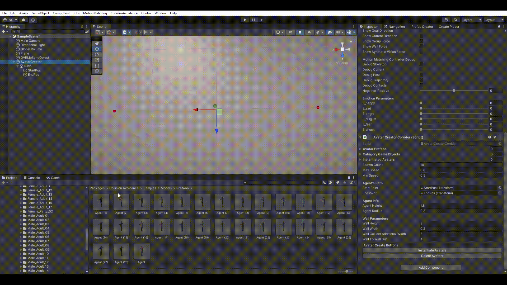

# Collision Avoidance System

Welcome to the Collision Avoidance System repository, where agents dynamically navigate a simulated environment. This system simulates realistic pedestrian behavior by integrating a variety of forces that guide agents towards their goals, enable avoidance of collisions, and facilitate natural group formations.


## Getting Started 
### Installation Steps
Follow these steps to set up your project:

1. **Import Motion Matching Package**
2. [**Install Collision Avoidance**](#installing-collision-avoidance)
3. [**Setup the Field**](#post-installation-setup)
4. [**Generate the Crowd**](#crowd-generation)
5. [**Create the Player**](#creating-a-first-person-camera-player)

### Prerequisites

Before starting, ensure your system meets the following requirements:

- **Unity 2021.2 or Newer**: This project requires Unity 2021.2 or a newer version. It has not been tested on earlier versions, so compatibility cannot be guaranteed.

- **Motion Matching Package**: It is essential to add the Motion Matching package to your project. For detailed instructions and more information about the Motion Matching package, please visit [JLPM22's Motion Matching GitHub repository](https://github.com/JLPM22/MotionMatching).

### Installing Collision Avoidance

1. Open the Unity Editor on your machine.
2. Navigate to `Window > Package Manager` to open the Package Manager window.
3. In the Package Manager window, click the `Add (+)` button in the top left corner, then select `Add package by git URL...`.
4. Enter the following URL into the git URL field:

```
https://github.com/ReiyaItatani/MotionMatchingWithCollisionAvoidance.git?path=Assets/com.reiya.collisionavoidance
```

5. Click `Add` to start the installation process.

>**Note:** All sample scenes are configured for the **Universal Render Pipeline (URP)**. If you are using a different render pipeline, conversion of the scenes may be necessary.

### Post-Installation Setup

After installing the Collision Avoidance package, a new window titled **'Collision Avoidance'** will appear in the Unity Editor. This window includes several features to set up avatars and the scene layout:

- **Create Field**: Initialize your scene's layout with options like `For Video`, `With Wall`, `Without Wall`, `Cross Road`, and `Path`.
- **Create Player**: Instantly adds a default player to the scene equipped with a first-person camera.
- **Prefab Creator**: Creates the necessary avatar for this package.

>**Important Note:** After installing the project, please start by generating a field using the **Create Field** option. This step automatically creates necessary tags such as Player, Group, and Wall, which are essential for the functioning of the project.


### Crowd Generation

To generate avatars in your project, follow these steps:

1. **Prepare the Field**:
   - Begin by baking the field to create a `navmesh`. This is essential for navigation and movement within the scene.
2. **Use 'Create Field'**:
   - After baking the field, use the 'Create Field' option to select `ForVideo`, `WithWall`, `WithoutWall`, `CrossRoad`, or `Path`.
   - `ForVideo` generates one or multiple avatars for a single agent.
   - `WithWall` creates walls along the edges.
   - `WithoutWall` does not create walls along the edges.
   - `CrossRoad` creates a CrossRoad scenario.
   - `Path` generates multiple avatars along a path consisting of multiple points.
   - **It is recommended to primarily use `Path`.**
3. **Press `Path` Button in the 'Create Field'**:
   - Pressing `Path` will create game objects named `OVRLipSyncObject` and `AvatarCreator`.
   - [OVRLipSync](https://developer.oculus.com/documentation/unity/audio-ovrlipsync-unity) is used for LipSync when the avatars are speaking.
   - The `AvatarCreator` will have scripts named `AgentManager` and `AvatarCreatorPath` added to it.
     - `AgentManager` allows you to set parameters for all agents.
     - The `AvatarCreatorPath` script is used to generate avatars.
4. **Configure `AvatarCreatorPath`**:
   - Drag and drop the avatars located in `Packages/CollisionAvoidance/Samples/Models/Prefabs` into the `Avatar Prefabs` field.
   - Set the `Spawn Count` to a value, for example, 10.
   - Specify the path you want the agents to walk on in the `AgentPath`.
   - Additionally, click on `Add Social Relation` under `Social Relations` to add social relationships among the avatars.
   - When you click on 'Add Social Relations', an 'Individual' is automatically added. Furthermore, by pressing it again, 'Individual', 'Couple', 'Friend', 'Family', and 'CoWorker' are automatically added.
   - Avatars generated with the 'Individual' tag will walk alone, while those generated with any other tags will form groups and walk together.



5. **Instantiate Avatars**
   - Click on `InstantiateAvatars` to generate the avatars in the scene.


## Creating a First-Person Camera Player

Follow these steps to create a player with a first-person camera in your scene:

1. **Open 'Create Player' Window**
   - Begin by opening the 'Create Player' window in your Unity Editor.

2. **Configure Motion Matching Data**
   - In the 'Motion Matching Data' field, select a data file from `Packages/CollisionAvoidance/Samples/Animations/MMData`.

3. **Set Humanoid Avatar**
   - For the 'Humanoid Avatar' field, choose an avatar from `Packages/CollisionAvoidance/Samples/Models/MicroSoftRocketBox/Female_Adult_01/mixamorig`.

4. **Create the Player**
   - Click on `CreatePlayer` to generate the player in your scene.

5. **Player Movement**
   - The created player can be moved using the WASD keys.
   - It utilizes the `SpringCharacterController`.

6. **Learn More About the Controller**
   - For detailed information on the `SpringCharacterController`, refer to the [Motion Matching documentation](https://jlpm22.github.io/motionmatching-docs/basics/character_controller/).


## Final Step: Running the Project

Once you have completed the 'Avatar Generation Method' and 'Creating a First-Person Camera Player' steps:

1. **Run the Unity Project**
   - Click the 'Run' button in your Unity Editor.

2. **View the Moving Agents**
   - After running the project, you should be able to see the moving agents in action within your scene!

These steps will allow you to witness the results of your setup, with avatars moving around the environment and the first-person camera player in action.


---


We encourage contributions and inquiries—please open an issue or submit a pull request if you wish to collaborate or have questions.
